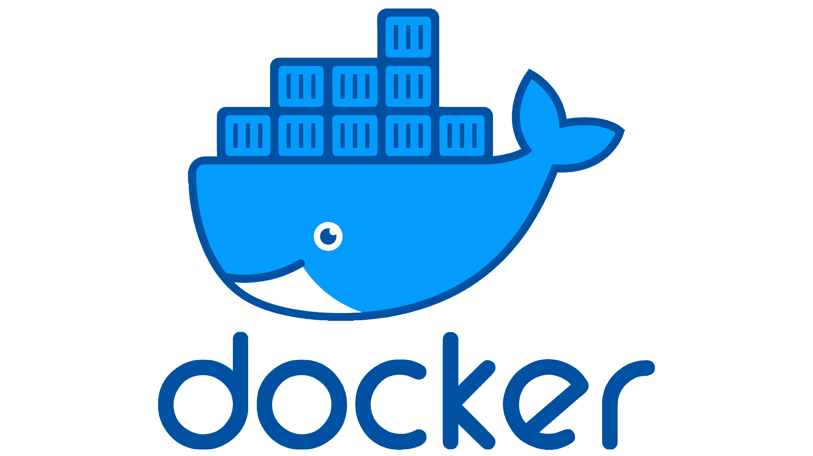

## 说明



教程使用基于 docker 的 caddy 实现各类型服务的搭建，具有以下特性：自动 SSL 证书、通配符证书（泛域名）申请，自动续期，易于迁移等功能，基本取代 NGINX 实现高性能反向代理。迁移的化仅仅需要打包当前文件夹，移动到新服务器下重新启动相应服务即可实现。

## 前提和基础

Linux 操作系统，配置好用户名，安装 docker，并确保服务正常运行（运行 docker ps 不会报错）。当前 docker 最新版已经集成 docker-compose，所以不需要重复安装 docker-compose，只是原有的命令`docker-compose` 变更为 `docker compose`（去掉中间的`-`）.

> 新建用户不是必要操作，不过建议操作是这样。SSH应当设置为禁用Root登录，需要使用高等级的权限则使用`sudo`命令。

```shell
# 以下均在root用户下执行
adduser test  #新建一个test用户
export DOWNLOAD_URL="https://mirrors.tuna.tsinghua.edu.cn/docker-ce" #国内
curl -fsSL https://get.docker.com/ | sh  # 如使用 curl
# wget -O- https://get.docker.com/ | sh   # 如使用 wget
usermod -aG sudo,docker test  # 将test添加至sudo及docker组当中
newgrp docker     #更新用户组
```

> 从现在开始所有的命令都是基于`test`用户执行，当前的目录为`/home/test`，而不是`/root`。

### 配置 Caddy 服务器

使用普通用户`test` 执行如下操作：新建文件夹及相应配置文件。

```shell
mkdir /home/test/CaddyWeb && cd /home/test/CaddyWeb
touch access.log .env docker-compose.yaml Caddyfile && mkdir caddy_data
```

提供 caddy 的 docker-compose 配置文件，主要采用 host 模式（必须），占用了 80 和 443 端口，文件内容如下，

```yaml
# Path:/home/test/CaddyWeb/docker-compose.yaml
services:
  caddy:
    image: ghcr.io/caddybuilds/caddy-cloudflare:latest
    restart: unless-stopped
    env_file:
      - $PWD/.env
    cap_add:
      - NET_ADMIN
    # ports:
    #   - "80:80"
    #   - "443:443"
    #   - "443:443/udp"
    network_mode: host
    volumes:
      - $PWD/Caddyfile:/etc/caddy/Caddyfile
      - $PWD/access.log:/var/log/caddy/access.log
      - $PWD/caddy_data:/data/caddy
```

为安全起见，所有的服务 (rss,aria2c,pan,) IP 绑定为 localhost，不为 0.0.0.0，因此不能够通过 IP 地址访问服务；.env 文件存放较为敏感的信息，如域名、Cloudflare Token 等.Caddyfile 配置文件也比较简单，此处实现泛域名证书，需要提前设置相应子域名 DNS 解析。

```shell
# Path:/home/test/CaddyWeb/.env
SERVER_NAME="example.com"
CLOUDFLARE_API_TOKEN="自行修改"`
# Path:/home/test/CaddyWeb/Caddyfile
{
 order reverse_proxy before route
 admin off
 log {
  output file /var/log/caddy/access.log {
   roll_size 100mb
   roll_keep 5
   roll_keep_for 4320h
  }
 }
  #证书自动申请续期。
 acme_dns cloudflare {env.CLOUDFLARE_API_TOKEN}
}

# 泛域名设置
*.{$SERVER_NAME} {$SERVER_NAME} {
 #root * /var/www/html
 file_server
 encode gzip

 @root host {$SERVER_NAME}
  # 从上往下模式匹配,默认则为最后一项： aria2c: https://example.com/jsonrpc 端口号为443不为6800;
  # 
 handle @root {
  reverse_proxy /jsonrpc localhost:6800     # aria2c 配置设置
  reverse_proxy /Seick localhost:65178     # 奇怪的伪装Path的服务
  reverse_proxy /frac localhost:27015      # 异星工厂服务器
  reverse_proxy localhost:22303 # chagpt
 }
  # 此处注意标签@pan ,访问网址为 pan.example.com，需要提前解析pan 子域名
 @pan host pan.{$SERVER_NAME}
 handle @pan {
  reverse_proxy localhost:5244  #Alist服务
 }
 @latex host latex.{$SERVER_NAME}
 handle @latex {
  reverse_proxy localhost:8085   # latex服务
 }

 @admin host admin.{$SERVER_NAME}
 handle @admin {
  reverse_proxy localhost:38574         #1panel服务
 }
 @rss host rss.{$SERVER_NAME}
 handle @rss {
  reverse_proxy localhost:8080     #freshrss
 }
}
```

### 搭建各类型服务（以aria2c为例）

1. 该部分主要集中在搭建各类型服务，并且暴露出相应的端口。请自行查找相关服务的配置文件。使用 `aria2c` 举例来说：

```shell
# Path:/home/test/aria2down/docker-compose.yaml
services:
  Aria2-Pro:
    container_name: aria2-pro
    image: p3terx/aria2-pro
    environment:
      - PUID=65534
      - PGID=65534
      - UMASK_SET=022
      - RPC_SECRET=P3TERX
      - RPC_PORT=6800
      - LISTEN_PORT=6888
      - DISK_CACHE=64M
      - IPV6_MODE=false
      - UPDATE_TRACKERS=true
      - CUSTOM_TRACKER_URL=
      - TZ=Asia/Shanghai
    volumes:
      - ${PWD}/aria2-config:/config     #需要提前在目录中新建 aria2-config和 aria2-downloads 文件夹
      - ${PWD}/aria2-downloads:/downloads
    ports:
      - 127.0.0.1:6800:6800       # 没有使用 - 6800(可以任意选取，但是必须与Caddyfile反向代理的端口一致):6800 是基于安全考虑,
      - 127.0.0.1:6888:6888
      - 127.0.0.1:6888:6888/udp
    restart: unless-stopped
    logging:
      driver: json-file
      options:
        max-size: 1m
```

2. 配置caddyfile文件，设置反向代理端口。

```shell
# 选择caddyfile 合适的位置进行添加
reverse_proxy /jsonrpc localhost:6800     # aria2c 配置设置
```

### 常见的docker命令

在使用 Docker Compose 管理服务时，通常需要在 docker-compose.yaml 文件所在的目录下（如 /home/test/CaddyWeb 或者 /home/test/aria2down）执行命令。以下是一些常用的 Docker Compose 命令及其说明：

```shell
docker ps # 查看当前服务的状态
docker compose up # 在首次运行或进行重大更改后，建议先使用 docker compose up（不带 -d）来启动服务并观察输出，确保一切正常后再使用后台模式
docker compose up -d # 后台运行服务，按照设置完全不需要在进行管理，重启主机后等服务跟随docker自动启动
docker compose down   # 停止并移除所有容器、网络
docker compose stop  # 停止服务但不删除容器
docker compose start  # 启动已停止的服务
docker compose restart {服务名称} # 仅仅修改挂载的配置文件,如果存在多个子服务的话重启单个子服务需要提供名称(Aria2-Pro)
docker compose down --rmi all --volumes --remove-orphans  # 删除所有未使用的容器、网络和镜像
```

## 注意事项

- 当前使用的具有 docker 运行权限的 test 用户，配置文件夹放在当前用户目录下。如果使用 1panel，可以直接在 1panel 下运行部署相关服务。
- 部分内容 (docker 用法、镜像下载及 cloudflare API Token 申请等) 介绍不太详细，网上参考资料比较多，可以自行查询。国外服务器的话按照配置教程，完全不存在任何问题。CF 可以改用其他的 DNS 解析，如阿里、腾讯等等，此时可能需要修改相关的镜像及配置 Token 等。
caddy 申请的证书保存在 `/home/test/CaddyWeb/caddy_data` 当中，权限设置需要 root 用户进行查看。
- 如果不习惯命令行，推荐使用 1panel 面板（类似于宝塔等）的方式，界面轻量化，系统占用较低，可以管理相应的服务。
- 主流需要的服务大多提供了 `docker-compose` 的配置方式。个人常用的服务主要有：freshrss、aria2c、latex、alist、chat-acad,new-api 等。
- 在首次运行或进行重大更改后，建议先使用 `docker compose up`（不带 -d）来启动服务并观察输出，确保一切正常后再使用后台模式。如果只修改了挂载的配置文件，通常只需要重启相关服务即可，可以使用 `docker compose restart <service_name>`。
